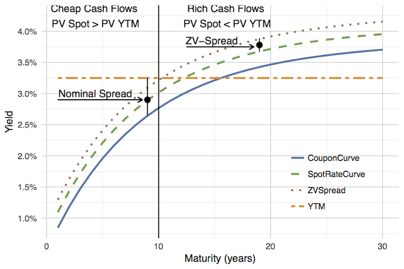

```{r, setup, include=FALSE}
knitr::opts_chunk$set(cache=FALSE)
require(termstrc)
require(BondLab)
require(sqldf)
require(RSQLite)
```
# Preface
Bond Lab® is an R package for the analysis of fixed income securities.  The 
analytical engines are modular in nature thereby allowing the user to create
a customized fixed income analytical output.  Bond Lab® is written in the S4
language and introduces a number of new classes.  

Bond Lab® classes are classified as those that support bonds (standard fixed income), mortgage- and asset-backed securities, analytic output, term structure. BondLab®
uses the following R packages:  
* termstrc  
* lubridate  
* methods  
* optimx  
* RCurl  
* splines  
* knitr  
* devtools  
* testthat  
* rmarkdown  

## The Bond Lab® Valuation Framework

The Bond Lab® valuation framework combines both linear and non-linear
term structure assumptions into a holistic valuation framework.  Bond cashflows
are viewed as bundle of zero coupon cashflows which are discounted along the
spot rate curve.  The value or price of a bond is sum of the individual 
valuation of each zero coupon cashflow.  The timing and magnitude of the 
cahflows determine the relative richness or cheapness of each cashflow.  

* The cheap cashflows are those whose present value along the spot curve are greater
than the yield to maturity (a linear term structure assumption) pricing of each cashflow.

* The rich cashflows are those whose present value along the spot rate curve are
less than the yield to maturity assumption pricing of each cashflow.



> the spread to the spot rate curve is referred to in the fixed income markets as
the **Zero Volatility Spread**. The zero volatility spread (ZV spread) is the 
spread which equates the present value of a bond's cash flows along the spot rate curve to its yield to maturity price. The zero volatility spread is the corner 
stone upon which the valuation framework is built, linking the linear and non-linear
term structure pricing assumptions.

Note: The term zero volatility spread when applied to the spot rate curve is technically incorrect. The
zero volatility spread is given by an option adjusted spread model and represents the average spread over
the spot curve in the OAS framework.  The measure as illustrated above is better defined the spread to the spot rate curve.

**From the *valuation framework* we can deduce the following:**  

 Relationship                            | Valuation
-----------------------------------------|-----------------------------------------
Zero Volatility Spread < Nominal Spread  | Rich cash flows outweigh cheap cash flows
Zero Volatility Spread = Nominal Spread  | Rich and cheap cash flows are balanced
Zero Volatility Spread > Nominal Spread  | Cheap cash flows outweigh rich cash flows 

## Bond Lab® Design Philosphy
Bond Lab® is designed to be modular. All classes are exposed to the user thereby allowing the user to create new class from existing classes (super class) or extend the classes as the user sees fit.  Thus, the user is free to combine these classes into a new class consiting of superclasses to fit her analytics needs or extend classes to incorporate additional analytic information.  The Bond Lab® classes are outlined below:

# Bond Lab® Classes

## Conversion Classes
Conversion classes take a value or string and convert the object to numeric,
basis, or string.

### PriceTypes
    The PriceTypes class represents price as passed to functions. Price is passed
    to functions as a character.  The PriceTypes class converts the character value
    to numeric and string values. It contains Price (numeric), Price32nds(string),
    PriceBasis (numeric), and PriceDecimalString (character).  Price are be passed
    to BondLab® functions as characters in either decimal (.) or 32nds (-) format.
    
### YieldTypes
    The YieldTypes class represents yield to maturity as passed from function.
    Yield to maturity is passed to the function in numeric decimal form (3.0).
    The YieldTypes class converts teh numeric decimal value to a basis value 
    0.30 and a character string.

### CouponTypes
    The CouponTypes class represents the bond coupon passed to a function.  Coupon
    is passed to function in numeric decimal form (5.5).  The CouponTypes class 
    converts the numeric decimal value to a basis 0.55 and character string
    
### GFeeTypes 
    The GFeeTypes class represents the guarantee fee, if any, passed to the cashflow
    engine.  GFee is passed to the function in numeric decimal form (0.35).
    The GFeeTypes converts the numeric decimal value to a basis 0.0035 and character
    string.

### GWacTypes 
    The GWacTypes class represents the borrower Gross WAC passed to the cashflow
    engine.  GWac is passed to the function in numeric decimal form (4.00).
    The GWacTypes converts the numeric decimal value to a basis 0.04 and character
    string.
    
### ServicingFeeTypes 
    The ServicingFeeTypes class represents the servicing fee passed to the cashflow
    engine.  Servicing fee is passed to the function in numeric decimal form (0.30).
    The ServicingFeeTypes converts the numeric decimal value to a basis 0.0030 
    and character string.

## Price, Term Structure, and Scenario classes
These classes contain the pricing and term structure classes need to price and evlauation the relative richness or cheapness of a bond or mortgage backed 
security


### TermStructure
    The TermStructure class represents the term structure of interest rates.  The 
    class contains forward rates, spot rates, two year forward, ten year forward.
    The constructuctor function TermStrucuture is a wrapper around the package 
    termstruc.

### CurveSpreads
    The CurvesSpreads class represents curve spreads.  It contains benchmark, 
    spread to benchmark, spread to curve, zero volatility spread.

### Scenario
    The scenario class represents interest rates used in total return scenario 
    analysis.  The user may define and scenario applied to either the coupon curve
    or the spot rate curve.  spot rate curve scenarios are designated with a trailing
    (s).

## Bond Classes  
Generally, speaking these classes pertain to a bond which pays a period coupon
monthly, quarterly, semi-annually, or annually.  The bond may be callable, 
putable, or have a sinking-fund schedule.  

### BondDetails
    The BondDetails class represents the cusip detail of a standard bond.  It
    includes all the relevant detail to analyze a standard fixed income
    security.  Call, Put, and Sinking Fund schedules are not yet implemented. 

### BondCashFlows
    The BondCashFlows class holds all the relevant detail regarding a bond's
    cashflow characteristics including: yield-to-maturity, weighted average
    life, modified duration, convexity, and bond cashflows coupon payments
    and principal payment(s), and total cash flow.

### BondTermStructure
    The BondTermStructure class represents the key rate duration and key rate
    convexity of bond.

### BondReturn
    The BondReturn class represents the total return of a bond.  The BondReturn
    class contains the coupon income, principal recieved, reinvestment income
    horizon balance, horizon price, horizon return, horizon months.  Note:
    currently under construction.

### BondScenario
    The BondScenario class represents the bond total return scenario analysis.  
    The superclasses of which are BondReturn, BondCashFlows, BondTermStructure, 
    and CurveSpreads.  Note: currently under construction.

## Mortgage Classes
Mortgage class pertain to both mortgage pass-through MBS and REMICs.  Mortgage
backed securities pay both principal and interest on a monthly basis, often with
a delay, based on the pool's underlying borrowers' prepayment rates.

### MBSDetails
    The MBSDetails class represents the cusip detail of a mortgage backed 
    security.  It includes all the relevant detail needed to determine the 
    cashflow and analyze a mortgage pass-through MBS.  The MBSDetails also
    includes reference to the prepayment model tuning file and is the primary
    means by which a prepayment model is assigned to a MBS cusip.
    
### MortgageCashFlow
    The MortgageCashFlow class holds the cashflow deatil of a mortgage-backed 
    security including: yield to maturity, modified duration and convexity,
    SMM, MDR, severity, scheduled interest, scheduled principal, 
    prepaid principal, etc.  The MortgageCashFlow class is used to cashflow a
    pass-through MBS security.

### MortgageTermStructure
    The MortgageTermStructure class represents the key rate duration and key
    rate convexity of a mortgage backed security.
    
### MortgageEffectiveMeasures
    The MortgageEffectiveMeasures class represents effective duration and 
    convexity measures.

### MortgageReturn
    The MortgageReturn class represents the total return of a mortgage backed
    security.  The MortgageReturn class contains the coupon income, scheduled 
    principal received, prepaid principal received, reinvestment income, 
    horizon current balance, horizon price, horizon return, and horizon months.
    
### MortgageScenario
    The MortgageScenario class represents the mortgage total return analysis. It
    is a superclass consisting of the classes TermStructure, PrepaymentAssumption
    MortgageCashFlow, MortgageTermStructure, MortgageReturn, ModelToCPR,
    CurveSpreads, Scenario.

### MortgageScenarioSet
    The MortgageScenarioSet class is a list of scenarios which can be used to 
    batch calculate MortgageScenario.
    
### MortgageOAS
    The MortgageOAS class represents the results of a mortgage OAS analysis.

## Prepayment Model Classes
    The prepayment model classes support the prepayment model used in Bond Lab®.  
    The Bond Lab® prepayment model is non-parametric in the sense that the model 
    makes no assumption as to the underlying distributional properties of mortgage
    prepayment rates.

### PrepaymentAssumption
    The PrepaymentAssumption class represents the output of the prepayment model,
    Prospectus Prepayment Curve (PPC) and CPR.  The class is used to pass 
    prepayment assumptions to mortgage casflow.
    
## PrepaymentModelTune
    The PrepaymentModelTune class represents the tuning parameters of the 
    BondLab prepayment model.  The use of a tuning class allows the user to 
    create custom prepayment models for different mortgage product types.
    The user may extend the class to add additional model tuning parameters
    in the event that PrepaymentModelFunctions slots are extended.
    
### PrepaymentModelFunctions
    The PrepaymentModelFunctions class represents functions used in the 
    construction of a mortgage prepayment model.  The user may add additional
    slots to the class to extend the prepayment model.
    

# Anatomy of a Bond Lab® Call

Bond Lab® is designed to be modular in nature.  The classes outlined above are
passed thereby providing input required for the next step in the analysis.  The
design is intened to allow users to create bespoke analytic functions addressing
the user's unique question or analytic framework.  Through inheritance users can 
create new superclasses from the subclasses outlined above.  The anatomy of a
Bond Lab call for MBS return analysis is outlined below

First query the database for available cusip data
```{r, sqlquery, echo=TRUE}
  MBSData <- dbConnect(SQLite(), dbname=paste0(system.file(package = "BondLab"), "/BondData/MBSData"))
  dbGetQuery(MBSData,
             'Select Cusip
             ,Coupon
             ,AmortizationTerm
             ,price 
             from MBS')
```


## Step One: define the required input for analysis

```{r, priceclass, echo=TRUE}
      cusip = "31283HY43"
      price <- dbGetQuery(MBSData, 'Select price from MBS where cusip = "31283HY43"')
      tradedate <- '05-19-2017'
      settlementdate <- '06-15-2017'
    # note PriceTypes class is used to convert price from string to
    # numeric decimal equivilant
    Price <- PriceTypes(price = as.character(price))
```

## Step Two: call the yield curve and fit the term structure model
```{r, termstructure, echo = TRUE}
   rates.data <- Rates(trade.date = tradedate)
   # note use invisible(capture.output()) to supress messages
   invisible(capture.output(
     TermStructure <- TermStructure(rates.data = rates.data, method = "dl")))
```

## Step Three: call the MBS either by cusip
```{r, bonddata, echo=TRUE}
    bond.id <- MBS(cusip = cusip)
```

## Step Four: call the mortgage prepayment model and its dependencies
```{r, prepayment, echo=TRUE}
    MortgageRate <- MtgRate()
    ModelTune <- ModelTune(bond.id = bond.id)
    #invoke the prepayment model and assign it to object
    Prepayment <- PrepaymentModel(bond.id = bond.id,
                                  TermStructure = TermStructure,
                                  MortgageRate = MortgageRate,
                                  ModelTune = ModelTune,
                                  PrepaymentAssumption = "MODEL")
```

## Step Five: call the mortgage cashflow function
```{r, cashflow, echo=TRUE}
PassThrough <-
  MortgageCashFlow(bond.id = bond.id,
                   original.bal = OriginalBal(bond.id),
                   settlement.date = settlementdate,
                   # note: here price is passed as decimal eqivalent string
                   # internally this function also uses PriceType to convert
                   # price to a numeric decimal basis
                   price = PriceDecimalString(Price),
                   PrepaymentAssumption = Prepayment)
```

## Step Six: Optional but recommended, calculate curve spread
```{r, spreads, echo=TRUE}
# curve spreads are also returned in the mortgagescenario object
# note: used getter methods on the classes to calculate proceeds
  proceeds = OriginalBal(bond.id) *MBSFactor(bond.id) * PriceBasis(Price)
# The class curve spreads calculates curve spreads for reporting
# or in this case to pass zero volatility spread to the total return function  
  CurveSpreads <- CurveSpreads(rates.data = rates.data,
                               TermStructure = TermStructure,
                               CashFlow = PassThrough,
                               proceeds = proceeds)
```

## Step Seven: Calculate Total Return
```{r, total return, echo=TRUE}

  invisible(capture.output(
    NoChangeScenario <- MortgageScenario(
      bond.id = bond.id,
      settlement.date = settlementdate,
      rates.data = rates.data,
      price = PriceDecimalString(Price),
      original.bal = OriginalBal(bond.id),
      scenario = "NCs",
      horizon.months = 12,
      method = "ns",
      prepayment = "MODEL",
      horizon.spot.spread = ZeroVolSpread(CurveSpreads))))
```

## Now, lets get some analytics out of the class MortgageScenario
```{r, return, echo=TRUE}
HorizonReturn(NoChangeScenario)
ZeroVolSpread(NoChangeScenario)
SpreadToCurve(NoChangeScenario)
SpreadToBenchmark(NoChangeScenario)
BenchMark(NoChangeScenario)
WAL(PassThrough)
```

## Create Your Own Function
Naturally, one does not wish to replicate the anatomy of a Bond Lab® call
repeatedly.  The user can create her own function to encapsulate the anatomy of 
a Bond Lab® call.

```{r, MyPassThrough, echo= TRUE}
MyScenario <- function(bond.id = "character",
                       trade.date = "character",
                       settlement.date = "character",
                       prepayment = "character",
                       ...,
                       price = NULL,
                       spread = NULL,
                       CPR = numeric()){
  
  Price <- PriceTypes(price = price)
  bond.id <- MBS(MBS.id = bond.id)
  rates.data <- Rates(trade.date = trade.date)
  MortgageRate <- MtgRate()
  ModelTune <- ModelTune(bond.id = bond.id) 
  
  invisible(capture.output(
     TermStructure <- TermStructure(rates.data = rates.data, method = "ns")))
  
    #invoke the prepayment model and assign it to object
    Prepayment <- PrepaymentModel(bond.id = bond.id,
                                  TermStructure = TermStructure,
                                  MortgageRate = MortgageRate,
                                  ModelTune = ModelTune,
                                  PrepaymentAssumption = prepayment,
                                  CPR = CPR)
  CashFlow <-
  MortgageCashFlow(bond.id = bond.id,
                   original.bal = OriginalBal(bond.id),
                   settlement.date = settlementdate,
                   # note: here price is passed as decimal eqivalent string
                   # internally this function also uses PriceType to convert
                   # price to a numeric decimal basis
                   price = PriceDecimalString(Price),
                   PrepaymentAssumption = Prepayment)
  
  # note: used getter methods on the classes to calculate proceeds
  proceeds = OriginalBal(bond.id) *MBSFactor(bond.id) * PriceBasis(Price)
  # The class curve spreads calculates curve spreads for reporting
  # or in this case to pass zero volatility spread to the total return function  
  CurveSpreads <- CurveSpreads(rates.data = rates.data,
                               TermStructure = TermStructure,
                               CashFlow = PassThrough,
                               proceeds = proceeds)
  
    invisible(capture.output(
      Scenario <- MortgageScenario(
      bond.id = bond.id,
      settlement.date = settlementdate,
      rates.data = rates.data,
      price = PriceDecimalString(Price),
      original.bal = OriginalBal(bond.id),
      scenario = "NCs",
      horizon.months = 12,
      method = "ns",
      prepayment = "MODEL",
      horizon.spot.spread = ZeroVolSpread(CurveSpreads))))
    
    return(Scenario)

}

```